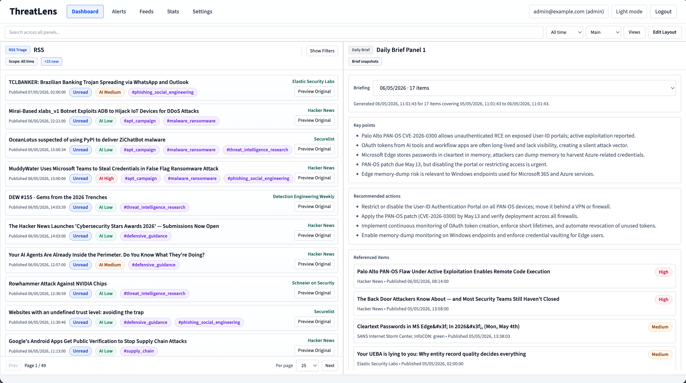
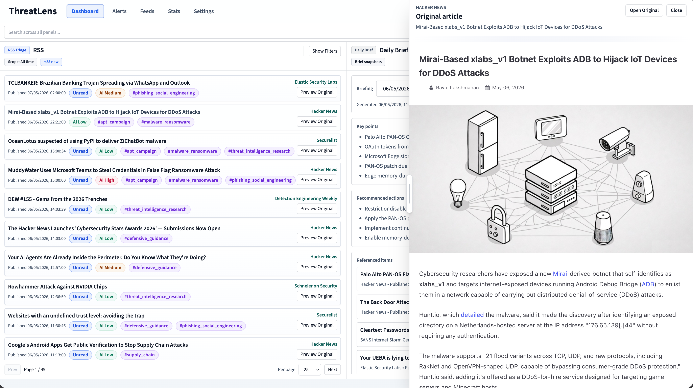
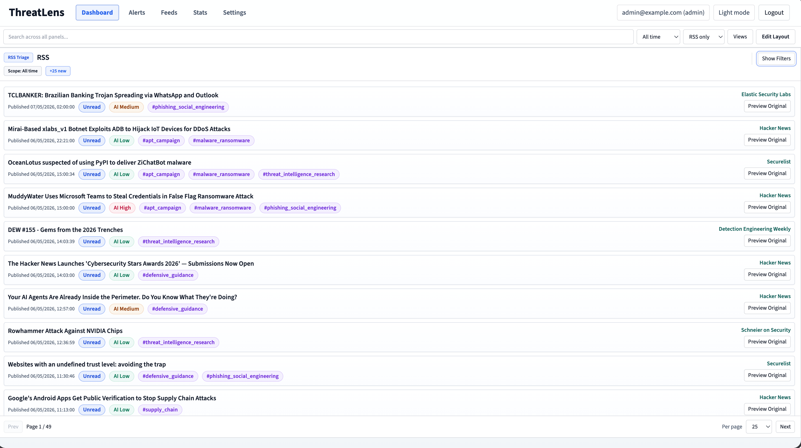

# ThreatLens

ThreatLens is a self-hosted app for tracking security (or any other) RSS feeds and articles.

It stores feeds, extracts article text, and gives a single pane of glass to review articles, alerting matches, optional AI summaries/recommendations. 

## Screenshots



| Original article preview | RSS-only triage view |
|---|---|
|  |  |

## Features

- RSS feed collection and article extraction
- Read/starred state, notes, tags, and saved dashboard views
- Keyword alert interests with preview before saving
- Filtered article export as CSV, JSONL, ThreatLens ZIP, STIX 2.1, MISP, or readable PDF bundles
- Feed backup/restore plus webhook and multi-hook SMTP notifications
- Role-based users: `admin`, `analyst`, and `viewer`
- OpenID Connect SSO with account linking, verified-email JIT provisioning, and claim-to-role mapping
- API tokens and audit logs
- Durable integration outbox, bounded retries, dead-letter replay, circuit breaking, and delivery metrics
- Optional AI summaries, relevance scoring, task history, and daily briefs
- Prompted, sourced intelligence reports with templates, schedules, context-safe chunking, and Markdown/HTML/PDF artifacts

## Quick Start

Create a local environment file with fresh random secrets:

```bash
./bootstrap.sh
```

The script prints the generated admin login. To choose your own admin identity, run:

```bash
ADMIN_EMAIL=you@example.com ADMIN_PASSWORD='use-a-long-password' ./bootstrap.sh
```

For a production or internet-facing deployment, review `.env.example` and replace any local-only settings before first startup.

Pull the latest published images and start everything:

```bash
docker compose pull
docker compose up -d
```

The default `latest` tag follows the newest published default image, and the bundled compose file asks Docker to refresh ThreatLens application images during `up`. To pin a specific release, set `THREATLENS_IMAGE_TAG` to an immutable image tag:

```bash
THREATLENS_IMAGE_TAG=1.0.0 docker compose pull
THREATLENS_IMAGE_TAG=1.0.0 docker compose up -d
```

Or build the images locally from source:

```bash
THREATLENS_BUILD_VERSION="$(cat VERSION)" docker compose -f docker-compose.yml -f docker-compose.build.yml up -d --build
```

Open the app:

```text
http://localhost:3000
```

Log in with `ADMIN_EMAIL` and `ADMIN_PASSWORD`.

After the first admin account exists, set `SEED_ADMIN_ON_STARTUP=false` for normal use.

## Portainer

You can paste `docker-compose.yml` into a Portainer stack without uploading a `.env` file.

Generate pasteable Compose environment mappings:

```bash
./bootstrap.sh --print-compose-env
```

Replace the `x-db-environment`, `x-redis-environment`, and `x-backend-environment` blocks at the top of `docker-compose.yml` with the full output before deploying the stack. To choose your own admin identity, run:

```bash
ADMIN_EMAIL=you@example.com ADMIN_PASSWORD='use-a-long-password' ./bootstrap.sh --print-compose-env
```

Keep `APP_DATA_ENCRYPTION_KEY` stable across upgrades.

The generated mapping is for HTTP-only local or LAN testing:

```text
APP_ENV: 'development'
AUTH_COOKIE_SECURE: 'false'
```

For HTTPS or internet-facing deployments, review `.env.example` before first startup.

The generated mapping includes explicit internal `DATABASE_URL` and `REDIS_URL` values so Portainer does not need separate stack variables.
For `.env`-based deployments, set `THREATLENS_WEB_PORT` if port `3000` is already in use and `THREATLENS_IMAGE_TAG` if you want a pinned release; for paste-only Portainer deployments, edit the `web.ports` entry or image tags in the compose file.

## AI

AI is disabled by default.

To enable it, set:

```bash
AI_ENABLED=true
```

Then open **Settings -> AI** and configure an OpenAI-compatible endpoint, model, and API key if needed.
For Ollama, use either the server origin such as `http://192.168.0.113:11434` or the explicit OpenAI-compatible base `http://192.168.0.113:11434/v1`.

If your AI provider is on a private network, also set:

```bash
ALLOW_PRIVATE_NETWORK_AI=true
```

ThreatLens works without AI.

## Useful Commands

Update to the latest published images:

```bash
docker compose pull
docker compose up -d
```

Update to a pinned release:

```bash
THREATLENS_IMAGE_TAG=1.0.0 docker compose pull
THREATLENS_IMAGE_TAG=1.0.0 docker compose up -d
```

Check services:

```bash
docker compose ps
```

View logs:

```bash
docker compose logs -f api
docker compose logs -f worker
docker compose logs -f worker-ai
docker compose logs -f worker-maintenance
docker compose logs -f worker-notifications
docker compose logs -f beat
docker compose logs -f web
```

For temporary deep diagnostics, set `LOG_LEVEL=DEBUG` and `LOG_DETAIL=verbose` in `.env`, then recreate the API, workers, and Beat. Set `LOG_FORMAT=json` for structured collectors, or use `LOG_LEVEL_OVERRIDES=logger.name=DEBUG` for a focused subsystem. ThreatLens excludes request bodies, task argument values, and credential-bearing headers and redacts common secret patterns even in verbose mode; see [Configuration](docs/reference/configuration.md#diagnostic-logging) for the complete controls.

If the first startup fails with `Role "threatlens" does not exist`, an old PostgreSQL volume was likely initialized before the generated `.env` was in place. For a new install with no data to keep, reset the local volumes:

```bash
docker compose down -v
docker compose up -d
```

Run migrations:

```bash
docker compose exec api alembic upgrade head
```

Stop the stack:

```bash
docker compose down
```

Stop and remove the database/Redis volumes too:

```bash
docker compose down -v
```

## Local Development

Backend:

```bash
cd backend
python3 -m venv .venv
./.venv/bin/pip install -r requirements-dev.txt
./.venv/bin/alembic upgrade head
./.venv/bin/uvicorn app.main:app --reload
```

Worker and scheduler:

```bash
cd backend
./.venv/bin/celery -A app.tasks.celery_app.celery_app worker --loglevel="${LOG_LEVEL:-INFO}" --queues=default,ingest,processing -n 'worker@%h'
./.venv/bin/celery -A app.tasks.celery_app.celery_app worker --loglevel="${LOG_LEVEL:-INFO}" --concurrency=1 --queues=ai,ai-reports-v2 -n 'ai@%h'
./.venv/bin/celery -A app.tasks.celery_app.celery_app worker --loglevel="${LOG_LEVEL:-INFO}" --queues=maintenance -n 'maintenance@%h'
./.venv/bin/celery -A app.tasks.celery_app.celery_app worker --loglevel="${LOG_LEVEL:-INFO}" --queues=notifications -n 'notifications@%h'
./.venv/bin/python -m app.tasks.beat_watchdog
```

Frontend:

```bash
cd web
npm ci
npm run dev
```

## Tests

Backend:

```bash
cd backend
./.venv/bin/python -m pytest
```

Frontend:

```bash
cd web
npm ci
npm test
npm run lint
npm run build
```

## Notes

- The default Docker setup runs PostgreSQL, Redis, the API, worker, scheduler, and web UI.
- Published application images can be pinned with `THREATLENS_IMAGE_TAG`; `latest` tracks the newest default published image, while release tags and `sha-*` tags are immutable references.
- The browser talks to the API through `/api/v1`.
- Feed/article fetching, AI calls, webhook and SMTP delivery, and OIDC provider communication can make outbound network requests.
- Private-network outbound access is off by default. Enable only what you trust in `.env` or your stack environment.
- OIDC requires HTTPS by default. `ALLOW_INSECURE_HTTP_OIDC=true` is intended only for isolated local development; private IdPs remain separately controlled by `ALLOW_PRIVATE_NETWORK_OIDC`.
- Keep `APP_DATA_ENCRYPTION_KEY` safe. Stored feed, webhook, delivery, and OIDC client-secret data depends on it.
- Use `.env.example` as the configuration reference.

## License

Apache-2.0. See [LICENSE](LICENSE).
