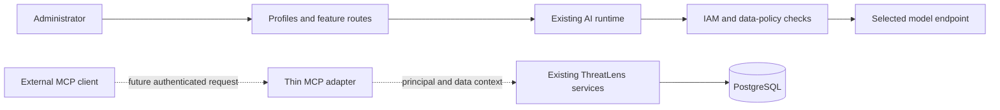

# ADR 0006: AI Provider Profiles, Routing, and the Future MCP Boundary

- Status: Accepted for provider profiles and routing; proposed for MCP exposure
- Date: 2026-09-11

## Context

ThreatLens uses an OpenAI-compatible chat-completions client for article
enrichment, daily briefs, and reports. A single endpoint forces installations to
choose one model and one destination for every feature. Operators need named
configurations for different models and local or hosted endpoints while keeping
existing installations working.

Provider selection also determines where article text and company context leave
ThreatLens. Adding a profile changes an outbound trust boundary; a profile is not
an independent authorization grant. Existing handling-label checks, durable task
history, attempt receipts, cancellation, and request budgets still apply.

An MCP server is a separate possible feature: it would let an external AI client
read authorized ThreatLens information. Storing model credentials does not enable
external tool execution or make ThreatLens an MCP client.

## Decision: provider profiles and routing

Keep the existing modular monolith and provider runtime. Add named provider
profiles with stable identifiers, endpoint/model settings, independent encrypted
credentials, an enabled state, and optimistic versions. Profiles use the existing
OpenAI-compatible adapter; their names do not imply native support for a vendor's
different API protocol.

Separate provider configuration from feature configuration. Prompt instructions,
company context, feature switches, and report planning limits remain in AI
settings. A routing record selects a default profile and optional overrides for
`item_enrichment`, `daily_brief`, and `report`.

| Routing value | Meaning |
| --- | --- |
| Named profile for a feature | Use that profile for the feature. |
| `null` for a feature | Inherit the default selection. |
| Named default profile | Use that profile wherever a feature inherits. |
| `null` default profile | Use the existing single-provider settings. |

The number of profiles is not represented by fixed provider slots. List operations
must be bounded and support pagination. Only the selected profile is resolved for
a call; selecting one provider does not contact the others.

There is no automatic failover between profiles. Inheritance is configuration
selection, not a recovery strategy. A disabled, missing, or unreadable selected
profile fails explicitly instead of sending data to another endpoint. Changing a
route affects future selections and does not silently retarget a prepared call.

### Credentials and endpoint identity

- A named profile uses only its own stored credential. It never inherits another
  profile's key or the server's legacy `AI_API_KEY`.
- Credential updates distinguish retaining a saved key, replacing it, and clearing
  it. API responses disclose presence, never plaintext or ciphertext. Browser
  drafts must not persist entered keys in local storage or saved drafts.
- A stored key is bound to the profile's endpoint origin. An origin change requires
  an explicit credential decision; retaining the old key must not send it to the
  new host. Scheme, host, and effective port participate in that decision.
- Legacy `AI_API_KEY` behavior remains restricted to the supported OpenAI HTTPS
  origin. Named profiles support independently supplied credentials for other
  OpenAI-compatible endpoints.
- Use the existing application encryption key and rotation/readability tooling.
  Unreadable ciphertext is an actionable configuration failure, not an empty key.
- Reject URL user information, query strings, fragments, invalid ports, and unsafe
  schemes. Public endpoints require HTTPS. Private-network access remains subject
  to the existing deployment opt-in and runtime DNS/IP checks. Redirects must not
  forward a bearer credential to a different destination. Named HTTP providers
  additionally restrict resolved, pinned connection addresses to nonpublic
  unicast destinations, preserving local hostnames without allowing public HTTP.

### Execution and recovery

Capture the selected profile's identifier and version when work is queued, without
persisting its key in task metadata. Resolve that selection into an immutable
runtime snapshot at execution. Bind the selection to the request fingerprint and
attempt history, without including secret material. Check the selected
configuration again before provider I/O so disablement, deletion, and edits cannot
race a prepared request.

The existing runtime locks IAM and data-policy state, the task, and the attempt
receipt through the outbound call and settlement. Provider configuration checks
must fit the same lock order; configuration mutations must not introduce a reverse
order that deadlocks against workers.

Transport outcomes remain distinct:

- A failure known to precede sending can be retried within the durable budget.
- A received provider response follows the existing retry classification.
- An uncertain transmission or unsettled receipt blocks automatic retry until the
  existing reconciliation workflow resolves it.

Changing profiles, creating a replacement task, or restarting a worker must not
erase an unresolved attempt or reset the logical operation's retry budget. A
connection test uses the same endpoint, credential, transport, and permission
checks with synthetic content; it does not send stored article context.

### Compatibility

Existing single-provider settings and routes remain available. With no named
selection, feature behavior continues through the legacy configuration. Profile
creation alone does not change active routing. Global AI enablement still controls
whether AI work is available.

Legacy-era queued tasks that lack a provider-selection snapshot continue to use
legacy settings. Their provider-attempt request fingerprints retain the original
shape. New named selections add profile identity/version to that fingerprint.
Enrichment source hashes additionally cover editable configuration that was
previously omitted. Existing results remain stored; this does not enqueue a bulk
regeneration, but a later requested enrichment may detect changed inputs.

Profile management remains an administrator operation with the relevant AI token
scope. An analyst's permission to generate a report does not grant permission to
read provider credentials, change routes, or select an arbitrary destination.

## Proposed future decision: expose existing services through MCP

This section is design groundwork. This change adds no MCP endpoint, SDK,
authorization server, listener, external MCP connection, or executable tool.

The first proposed MCP surface is read-only discovery and retrieval: bounded item
search/detail, accessible investigation evidence, and permitted report metadata
and artifacts. Each operation maps to an existing service and preserves its
scopes, ownership, investigation membership, handling labels, lineage checks, and
not-found behavior. Where authorization currently lives in an HTTP route, extract
a shared application service before exposing that operation; importing route
functions or querying models directly is not a substitute.

The adapter authenticates every request and constructs the same principal and
data-access context used by HTTP callers. Cursors, artifact handles, resource
identifiers, and any later asynchronous handles must remain bound to that
principal and authorized resource. A tool description, client capability, model
request, or provider credential never grants access.

### Protocol and authentication baseline

Pin implementation work to a tested protocol revision. On 2026-09-11, the current
specification is **2026-07-28**: requests are self-contained, capability negotiation
is per request, and `server/discover` is required. The previous initialization and
session mechanisms require a separate compatibility decision. Do not promise
support for both eras before interoperability tests exist.
See the [current protocol changes](https://modelcontextprotocol.io/specification/2026-07-28/changelog).

For a remote server, propose Streamable HTTP behind the existing deployment's
HTTPS ingress. Validate Origin, bound request/response sizes and execution time,
and reject mismatches between the protocol/method/name headers and the message
body. The 2026 revision uses POST and request-scoped responses; reconnecting is not
proof that a cancelled or interrupted operation had no effect.
See [Streamable HTTP](https://modelcontextprotocol.io/specification/2026-07-28/basic/transports/streamable-http).

Treat ThreatLens as an OAuth protected resource. A future implementation needs
protected-resource metadata, an explicit authorization-server integration, token
issuer/audience validation, and per-operation scope checks. Existing OIDC browser
login makes ThreatLens an OIDC client; it does not automatically make ThreatLens
an OAuth authorization server. Existing API tokens may inform a separately
documented client compatibility mode, but are not a substitute for the full MCP
OAuth discovery flow. Never forward an inbound MCP token to an AI provider.
See [MCP authorization](https://modelcontextprotocol.io/specification/2026-07-28/basic/authorization)
and [token audience and upstream separation](https://modelcontextprotocol.io/specification/2026-07-28/basic/authorization/security-considerations).

### Limits and launch gates

The future adapter must treat article content, reports, and notes as untrusted
data, including instructions embedded in them. Responses preserve provenance and
access controls; retrieved text cannot change routing or execute tools. Exclude
provider credentials, administrative recovery, arbitrary SQL, filesystem paths,
arbitrary URL fetching, and model execution from the first tool catalogue.

Before exposing the first MCP endpoint, require authorization-parity tests for
each tool and resource, revoked/expired/wrong-audience token tests, handling-label
and private-investigation isolation tests, bounded paging and cancellation tests,
and protocol tests for the selected revision. Audit actor, operation, resource,
outcome, and correlation identifiers without retaining tokens or raw sensitive
arguments. Review MCP response disclosure as a data egress path to the external
client; ordinary read permission alone must not silently bypass export controls.

Future mutations require a separate design for explicit scopes, approval-policy
parity, expected versions, durable idempotency, and unknown outcomes. Consuming
external MCP servers requires its own allowlisting, remote authentication,
credential isolation, tool approval, and prompt-injection review. It does not
belong in provider profiles.

## Consequences

- Operators can route features to different model endpoints without changing
  feature prompts or replacing the durable execution pipeline.
- Profile keys create additional encrypted assets that backup and key-rotation
  procedures must cover.
- Explicit failures require operator intervention but preserve the chosen data
  destination and explain which configuration prevented execution.
- Future MCP work can reuse ThreatLens authorization and services while remaining
  independent of model-provider configuration and outbound tool consumption.
