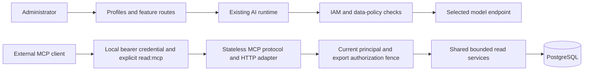

# ADR 0006: AI Provider Profiles, Routing, and the Read-only MCP Boundary

- Status: Accepted for provider profiles, routing, and the first read-only MCP scope
- Date: 2026-09-11
- MCP decision updated: 2026-09-17
- The initial MCP catalogue and local-token-only scope below are superseded by
  [ADR 0007](0007-delegated-mcp-authorization.md). Provider decisions remain in force.

## Context

ThreatLens uses an OpenAI-compatible chat-completions client for article
enrichment, daily briefs, and reports. A single endpoint forces installations to
choose one model and one destination for every feature. Operators need named
configurations for different models and local or hosted endpoints while keeping
existing installations working.

Provider selection also determines where article text and company context leave
ThreatLens. Adding a profile changes an outbound trust boundary; a profile is not
an independent authorization grant. Existing handling-label checks, durable task
history, attempt receipts, cancellation, and request budgets still apply.

The MCP server is a separate, optional feature that lets an external AI client
read authorized saved ThreatLens information. Storing model credentials does not
enable external tool execution or make ThreatLens an MCP client. Retrieval does
not invoke a model or require an AI provider configuration.

## Decision: provider profiles and routing

Keep the existing modular monolith and provider runtime. Add named provider
profiles with stable identifiers, endpoint/model settings, independent encrypted
credentials, an enabled state, and optimistic versions. Profiles use the existing
OpenAI-compatible adapter; their names do not imply native support for a vendor's
different API protocol.

Separate provider configuration from feature configuration. Prompt instructions,
company context, feature switches, and report planning limits remain in AI
settings. A routing record selects a default profile and optional overrides for
`item_enrichment`, `daily_brief`, and `report`.

| Routing value | Meaning |
| --- | --- |
| Named profile for a feature | Use that profile for the feature. |
| `null` for a feature | Inherit the default selection. |
| Named default profile | Use that profile wherever a feature inherits. |
| `null` default profile | Use the existing single-provider settings. |

The number of profiles is not represented by fixed provider slots. List operations
must be bounded and support pagination. Only the selected profile is resolved for
a call; selecting one provider does not contact the others.

There is no automatic failover between profiles. Inheritance is configuration
selection, not a recovery strategy. A disabled, missing, or unreadable selected
profile fails explicitly instead of sending data to another endpoint. Changing a
route affects future selections and does not silently retarget a prepared call.

### Credentials and endpoint identity

- A named profile uses only its own stored credential. It never inherits another
  profile's key or the server's legacy `AI_API_KEY`.
- Credential updates distinguish retaining a saved key, replacing it, and clearing
  it. API responses disclose presence, never plaintext or ciphertext. Browser
  drafts must not persist entered keys in local storage or saved drafts.
- A stored key is bound to the profile's endpoint origin. An origin change requires
  an explicit credential decision; retaining the old key must not send it to the
  new host. Scheme, host, and effective port participate in that decision.
- Legacy `AI_API_KEY` is bound to the HTTPS origin configured by
  `AI_API_KEY_BASE_URL`, which defaults to `https://api.openai.com`. Scheme, host,
  and effective port must match; omitting the HTTPS port means `443`. Paths do not
  restrict credential use. Existing nonmatching legacy endpoints continue without
  this key. Named profiles always use independently supplied credentials.
- Gemini uses the compatible base
  `https://generativelanguage.googleapis.com/v1beta/openai/` with a separate model
  identifier. Its bare origin and `/v1beta` path normalize to that base. Native
  `:generateContent` and `:streamGenerateContent` URLs are rejected with the
  compatible endpoint in the error; the adapter does not translate native Gemini
  request formats.
- Use the existing application encryption key and rotation/readability tooling.
  Unreadable ciphertext is an actionable configuration failure, not an empty key.
- Reject URL user information, query strings, fragments, invalid ports, and unsafe
  schemes. Public endpoints require HTTPS. Private-network access remains subject
  to the existing deployment opt-in and runtime DNS/IP checks. Redirects must not
  forward a bearer credential to a different destination. Named HTTP providers
  additionally restrict resolved, pinned connection addresses to nonpublic
  unicast destinations, preserving local hostnames without allowing public HTTP.

### Execution and recovery

Capture the selected profile's identifier and version when work is queued, without
persisting its key in task metadata. Resolve that selection into an immutable
runtime snapshot at execution. Bind the selection to the request fingerprint and
attempt history, without including secret material. Check the selected
configuration again before provider I/O so disablement, deletion, and edits cannot
race a prepared request.

The existing runtime locks IAM and data-policy state, the task, and the attempt
receipt through the outbound call and settlement. Provider configuration checks
must fit the same lock order; configuration mutations must not introduce a reverse
order that deadlocks against workers.

Transport outcomes remain distinct:

- A failure known to precede sending can be retried within the durable budget.
- A received provider response follows the existing retry classification.
- An uncertain transmission or unsettled receipt blocks automatic retry until the
  existing reconciliation workflow resolves it.

Changing profiles, creating a replacement task, or restarting a worker must not
erase an unresolved attempt or reset the logical operation's retry budget. A
connection test uses the same endpoint, credential, transport, and permission
checks with synthetic content; it does not send stored article context.

### Compatibility

Existing single-provider settings and routes remain available. With no named
selection, feature behavior continues through the legacy configuration. Profile
creation alone does not change active routing. Global AI enablement still controls
whether AI work is available.

Legacy-era queued tasks that lack a provider-selection snapshot continue to use
legacy settings. Their provider-attempt request fingerprints retain the original
shape. New named selections add profile identity/version to that fingerprint.
Enrichment source hashes additionally cover editable configuration that was
previously omitted. Existing results remain stored; this does not enqueue a bulk
regeneration, but a later requested enrichment may detect changed inputs.

Profile management remains an administrator operation with the relevant AI token
scope. An analyst's permission to generate a report does not grant permission to
read provider credentials, change routes, or select an arbitrary destination.

## Decision: bounded read services through an opt-in MCP endpoint

Expose one stateless MCP endpoint on the existing API process: `/v1/mcp` at the
service and `/api/v1/mcp` through the bundled web proxy. It is disabled by default
and enabled with `MCP_ENABLED=true`. The first release supports local bearer
credentials only and makes no claim to implement the MCP OAuth discovery flow.

```mermaid
flowchart LR
    Admin[Administrator] --> Profiles[Profiles and feature routes]
    Profiles --> Runtime[Existing AI runtime]
    Runtime --> Policy[IAM and data-policy checks]
    Policy --> Provider[Selected model endpoint]
    Client[External MCP client] --> Token[Local bearer credential and explicit read:mcp]
    Token --> Adapter[Stateless MCP protocol and HTTP adapter]
    Adapter --> Access[Current principal and export authorization fence]
    Access --> Services[Shared bounded read services]
    Services --> DB[(PostgreSQL)]
```

The catalogue contains exactly five tools: `search_articles`,
`get_article_evidence`, `get_team_assessment`, `get_investigation`, and
`get_report`. Each tool requires its current feature permissions in addition to
the explicit MCP opt-in. Team assessments and investigations remain human-user
features; a service account cannot call or discover those tools. The existing
service-account permission allowlist also excludes `read:reports`, leaving only
the two article tools available to machine credentials. Saved results include
provenance, freshness, a canonical link, and explicit truncation metadata.

Keep the protocol parser independent of HTTP and database access. The HTTP adapter
resolves current principal, credential, authorization, and data-access contexts
on every request, then calls the bounded read service. Existing investigation and
report access decisions are shared with HTTP callers. Article reads reuse the
handling-label boundary used by article exports. Derived records preserve their
source-envelope and current-source checks. Team membership and assessment access
use their shared services. Missing and inaccessible records remain indistinct.

Retain the transaction authorization fence through publication of the response.
Credential revocation, expiry, principal eligibility, and changed authorization
or data policy must not be bypassed by a prepared result. Search cursors bind
principal, credential, filters, and policy revisions and expire after 30 minutes.
No MCP session state or persistent client authorization snapshot is retained.

Acquire and pin separate read and audit database connections before taking any
authorization locks. Keep both connections reserved through response transfer
and cleanup. Auditing must not need another pool checkout while the read holds
authorization fences.

### Protocol and authentication baseline

Implement **2026-07-28** with per-request metadata, `server/discover`, and
`tools/list`/`tools/call`. Discovery and listing return current caller-visible
metadata with `ttlMs=0` and `cacheScope=private`. All modern results include
`resultType=complete` and server identity in result `_meta`. A compatibility path
supports **2025-11-25** initialization, initialized notification, ping, and tools,
without issuing a session ID. Unknown versions and methods fail explicitly.
See the [current protocol changes](https://modelcontextprotocol.io/specification/2026-07-28/changelog).

Use Streamable HTTP behind the deployment's existing HTTPS ingress, returning
single JSON responses. Each protocol message is a POST; GET and DELETE are
unsupported. Validate explicit browser Origins and header/body consistency;
reject duplicate headers, JSON-RPC batches, malformed values, and unknown
arguments. No SSE stream, subscription, resource, prompt, asynchronous task, or
write tool is exposed. The current and legacy paths have automated checks using
the official Python SDK 2.2.0 HTTP client against the protocol adapter and the
real FastAPI endpoint with a scoped token and disposable PostgreSQL/Redis. The
route checks use an in-process HTTP transport; they do not test an external proxy
or establish compatibility with every hosted assistant.
See [Streamable HTTP](https://modelcontextprotocol.io/specification/2026-07-28/basic/transports/streamable-http).

Accept personal API tokens and service-account credentials only through the
Authorization bearer header. Require literal `read:mcp` in the stored credential
scope list plus the principal's current permission. Wildcards, default token
scopes, and legacy empty-scope compatibility do not opt an existing credential
into a new disclosure channel. Browser cookies, JWTs, query-string credentials,
and provider API keys are not accepted by MCP. Never forward the inbound token to
an AI provider.

OAuth-only clients are outside the first supported scope. Full remote OAuth
requires a separate authorization-server decision, protected-resource metadata,
issuer/audience validation, and tested scope delegation. Existing OIDC browser
login makes ThreatLens an OIDC client; it does not supply that OAuth server flow.
Local bearer-token compatibility is intentionally documented as a custom
authentication mode, not as OAuth compliance.
See [MCP authorization](https://modelcontextprotocol.io/specification/2026-07-28/basic/authorization)
and [token audience and upstream separation](https://modelcontextprotocol.io/specification/2026-07-28/basic/authorization/security-considerations).

### Limits, disclosure, and verification

Defaults are 16 KiB request bodies, 64 KiB complete JSON responses, a 15-second
operation/transfer deadline, 60 requests per minute per principal, 300 per source
IP, and a configured cap of four concurrent MCP requests per API process. Effective
admission is `min(MCP_MAX_CONCURRENT_REQUESTS, floor((DATABASE_POOL_SIZE + DATABASE_MAX_OVERFLOW) / 2))`;
enabling MCP requires capacity for at least two database connections. This pool
also serves ordinary API traffic. Strict JSON depth/node bounds and per-tool
collection/text limits apply before or during retrieval. Shared Redis
coordination is required for rate admission; local concurrency is not a global
cluster limit. Responses signal truncation and use no-store HTTP caching.

The operation deadline bounds SQL, new response output, and transfer, but is not
a hard wall-clock limit for the entire request. Initial shared-pool checkout,
connection establishment, and cleanup may overrun it. Ordinary database pool and
connection timeouts govern acquisition, and cleanup can add elapsed time. The
initial checkouts hold no authorization locks. Deadline checks after acquisition
prevent expired work from entering the authorized read.

Treat article content, reports, and notes as untrusted data, including embedded
instructions. Retrieved text does not select an outbound destination or execute
tools. Provider credentials, administrative recovery, arbitrary SQL, filesystem
paths, arbitrary URL fetching, model execution, and report/assessment generation
are outside the catalogue.

Test current authority, revoked/expired/incorrect-kind credentials, scope opt-in,
policy revisions, handling-label and private-investigation isolation, cursor
binding, response bounds, deadlines, and both supported protocol versions. Audit
metadata must exclude bearer tokens, raw search arguments, and returned article
content. The pinned SDK checks are isolated test dependencies, not backend runtime
dependencies.

External-client disclosure remains subject to current read/export controls, but
the receiving client has its own provider and retention policy. Revocation or
source deletion cannot recall delivered copies. Operators must approve that
destination before issuing an MCP credential. See the [MCP operator guide](../pages/mcp.md)
for configuration and the exact first-release boundaries.

Future mutations require a separate design for explicit scopes, approval-policy
parity, expected versions, durable idempotency, and unknown outcomes. Consuming
external MCP servers requires its own allowlisting, remote authentication,
credential isolation, tool approval, and prompt-injection review. It does not
belong in provider profiles.

## Consequences

- Operators can route features to different model endpoints without changing
  feature prompts or replacing the durable execution pipeline.
- Profile keys create additional encrypted assets that backup and key-rotation
  procedures must cover.
- Explicit failures require operator intervention but preserve the chosen data
  destination and explain which configuration prevented execution.
- MCP exposes saved evidence through shared authorization services independently
  of model-provider configuration and outbound tool consumption.
- Local bearer-token support enables clients with configurable headers, while
  OAuth-only hosted clients remain unsupported until a separate OAuth decision.
