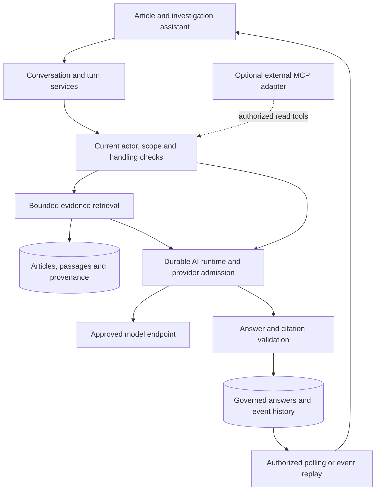

# Team workflows and an article assistant

Status: proposal, not implemented. Reviewed against `500871c` on `dev`,
2026-09-12, with separate team-workflow, AI-architecture, and access/lifecycle
reviewers. This document proposes additive features; it does not change runtime
behavior or establish production capacity.

ThreatLens could give analyst teams a shared place to triage intelligence, ask
questions of permitted evidence, and publish reviewed conclusions with traceable
sources. The strongest first package is named teams and shared triage, alongside
a cited assistant over deliberately selected articles and investigation evidence.

**Audience and scope.** Assume one self-hosted organization with multiple analyst
teams. The operator is a threat-intelligence/SOC analyst, the champion is a team
lead, and the deployment owner is the security/platform team. Other analysts and
report recipients benefit from reusable assessments. Budget ownership and demand
for a commercial edition have not been established. If commercialization matters,
team workflow and governed publication are a plausible first paid package; basic
article Q&A alone needs user validation as a purchasing reason.

The working pain hypothesis is duplicated reading, personal queues that do not
show who is handling an issue, and conclusions copied between tools without their
evidence. Validate this with one real shift-handover and investigation workflow.
Separate customer tenants/MSSP hosting require an additional isolation design
covering identities, data, jobs, caches, storage, policies, quotas and recovery.
Named teams inside this deployment would not establish customer isolation.

**Existing foundations and actual gaps**

| Area | Present today | Expansion needed |
| --- | --- | --- |
| Identity | OIDC, local/federated IAM groups, custom roles, service accounts and access governance. See [Settings](../pages/settings.md). | Object grants to named teams/groups, delegated team administration and provisioning/offboarding workflows. |
| Investigations | Individual membership roles, assignee, notes, evidence, activity, lifecycle and version conflicts. See [Investigations](../pages/investigations.md). | Group-backed membership, tasks, watchers, discussions and acknowledged handovers. |
| Visibility | `team` means installation-visible to eligible users, subject to data policy: [read predicate](../../backend/app/services/investigation_read_access.py). | Explicit named-team ownership and visibility. Preserve the existing visibility semantics on upgrade. |
| Alerts and views | Durable but owner-scoped alert triage; [saved views](../../backend/app/models/saved_view.py) belong to individual users. | Team queues, claims/assignment, shared watchlists and saved views. |
| Reporting | Shared generated reports, private/shared templates and administrator-managed schedules. See [Reporting](../pages/reporting.md). | Editorial review and publication, separate from generation status. |
| Integrations | SMTP/webhook connectors and durable delivery. | Collaboration events and optional bidirectional case-system adapters. |
| AI | Named compatible providers, feature routing, budgets, bounded transport, durable attempts, cancellation and evidence provenance. See [AI](../pages/ai.md) and [remediation](./2026-09-12-ai-remediation.md). | First-class chat resources, retrieval, conversation lifecycle and interactive capacity. |
| Retrieval | [Item search](../../backend/app/api/routes/items.py) matches title, summary and URL; trigram indexes support these paths. | Ranked article-body passages, then optional semantic retrieval. There is no embedding/conversation subsystem. |
| Protocols | Provider requests currently use `stream: False` and JSON response parsing. [MCP](../architecture/0006-ai-provider-profiles-and-mcp-boundary.md) is proposed only. | Qualified streaming/tool capabilities and a separate MCP adapter if external clients need it. |

Handling-label enforcement is configurable and defaults to disabled. Available
policy machinery is not proof that a particular installation enforces it; scoped
enterprise operation needs an explicit policy activation gate.

**Enterprise roadmap**

Effort labels compare scope, not elapsed-time commitments: Medium extends a few
existing workflows; Large crosses authorization, persistence, workers and UI.

| ID / priority | Proposed feature | Useful completion criterion | Effort |
| --- | --- | --- | --- |
| T01 / High | Named team workspaces backed by existing IAM groups, shared views and delegated administration. | Team members can find their work; group removal affects object access, search and delivery; existing private and installation-visible records preserve their semantics. | Large |
| T02 / High | Shared alert rules/watchlists and triage queues with claim/unclaim, owner, due date and escalation. | Two analysts cannot unknowingly claim the same occurrence; a lead can identify unattended work and hand it over. | Large |
| T03 / High | Investigation tasks/checklists, threaded comments, mentions, watchers and a collaboration inbox. | A shift handover records outstanding tasks and recipient acknowledgement; notifications respect current recipient access and preferences. | Medium–Large |
| T04 / Next | Report review, requested changes, approval and deliberate publication. | Approval pins exact content/evidence and destination; a subsequent edit invalidates it; required review gates scheduled delivery. | Large |
| T05 / Next | Team technology/business profiles and optional asset/software inventory integration. | Relevance explains which declared technology or verified inventory fact matched; it distinguishes potential relevance from confirmed exposure. | Medium initially; Large with inventory sync |
| T06 / Next | SCIM/directory lifecycle integration and ownership-transfer previews. | Deprovisioning promptly revokes access and identifies rules, schedules and final-owner investigations requiring reassignment. | Large |
| T07 / Demand-led | One bidirectional ticket/case connector with remote IDs, status mappings and visible sync conflicts. | Retried delivery creates one remote record; remote edits do not form update loops or bypass source-access restrictions. | Large |
| T08 / Next | Team outcome dashboards and AI governance: queue age, handover/review time, evaluated answer quality, usage and budgets. | Leads can compare team work and cost without exposing restricted cases; expensive reports cannot starve interactive assistance. | Medium–Large |

Team ownership is distinct from an individual assignee. Existing manual account
removal can be blocked by a final-owner investigation. Future authoritative
directory disablement must still revoke access immediately, using a governed
ownership-transfer or quarantine workflow for unresolved work rather than keeping
the departing user authorized. Retain evidence and require an eligible responsible
owner before quarantined work resumes. Implement these in existing
investigations/alerts, avoiding a second case system. Team-specific AI routes may
select only administrator-approved destinations;
membership cannot grant provider administration or weaken handling policy.

**What the chatbot should let an analyst do**

| Scope | Example question | Required answer behavior |
| --- | --- | --- |
| One article | “What is actually confirmed, and what remains speculation?” | Separate publisher claims, quoted evidence and assistant inference, with clickable passages. |
| Selected articles | “Where do these accounts disagree about exploitation?” | Compare dated claims, disclose contradictions and distinguish repeated syndication from independent sources. |
| Investigation | “What changed since our last review, and what needs follow-up?” | Compare evidence versions and permitted analyst context; identify gaps and draft a handover. |
| Filtered corpus | “Which articles this month discuss attacks on our declared stack?” | Show the time/feed scope, profile version, retrieval coverage and relevance rationale. |
| Quantitative corpus query | “How many matching articles did we ingest last week?” | Use a bounded, permission-filtered database aggregation with its filters/date basis; do not infer a total from top search results. |

Place **Ask about this article** in the article drawer and an **Assistant** tab in
the investigation workspace. Show scope chips for selected sources, date window
and team context, plus a source panel that opens the exact cited passage. Follow-up
questions retain explicit context; a scope change creates a visible new baseline.
Support history, Stop, recoverable failure states and analyst feedback. Saving an
answer as a note or report draft is an explicit, versioned action.

The first useful promise is: ask a follow-up question about permitted selected
evidence and receive an inspectable answer with citations, or a clear explanation
that evidence is insufficient. No training/fine-tuning or vector index is required
for that scope. Corpus-wide discovery is a separate increment.

**Proposed implementation boundary**

Keep the modular monolith, PostgreSQL and existing job machinery. Introduce narrow
application services for evidence retrieval, conversation access, turn lifecycle
and answer validation. HTTP and later MCP call those services; adapters should
neither import route handlers nor bypass them with ad hoc ORM queries.

| Work package | Concrete new work | Reuse and safeguards |
| --- | --- | --- |
| Conversations | Conversation, membership, immutable messages, turns, revisions, selected scope and source-dependency records. Start with private conversations and one active turn per conversation. | Reuse investigation membership patterns and optimistic conflicts. Sharing is explicit and never expands source permissions. |
| Selected evidence | Bounded current primary-text passages with source/version IDs, hashes and exact offsets or retained excerpt identity. | Generalize bounded report source projection and grounding; do not assume a mutable article row preserves historical text. |
| Durable chat execution | Add chat resource/feature types to tasks, ownership, attempt identities, receipts, cancellation, policy envelopes, route coverage and retention. | Preserve initiating-user authority, immutable provider selection and known/ambiguous transmission outcomes. Existing enums only cover current AI features. |
| Chat provider capability | Add chat routing and separate completion/input/time/call budgets. Begin with a structured final answer and progress polling. | Existing non-streaming compatible providers can support the initial scope after qualification; enabling chat does not change legacy routes. |
| Corpus retrieval | Versioned chunk index, full-text ranking, exact identifier paths, durable indexing and freshness status; optional embeddings/reranking. | Use permission-filtered SQL and bounded materialization. Keep lexical retrieval available during embedding outages. |
| Rich interaction | Replayable progress events, qualified token streaming, source panel, accessible keyboard/focus and session transitions. | A browser connection observes a durable job; it does not own the paid request or extend policy-lock lifetime. |
| Governed actions | Proposed note/task/report-draft changes with a reviewable diff and explicit user submission. | Existing object scopes, approval policies, expected versions and idempotency remain authoritative. |

Proposed REST resources, relative to `/api/v1`, are `/conversations`,
`/conversations/{id}/messages`, `/conversations/{id}/turns`,
`/conversations/{id}/turns/{turn_id}` and a cancellation command. These are design
sketches, not existing endpoints. A send records a client-generated idempotency
key and parent/conversation version, then returns an accepted durable turn ID.
The same key/body resumes the same operation; reuse with different content returns
a conflict. Bound lists with opaque keyset cursors. Use polling first, then an
authorized event endpoint with sequence IDs and bounded replay when justified.

Distinguish queued, retrieving, generating, validating, completed, failed and
cancelled states. An unresolved provider transmission needs an attention state
and reconciliation, not an automatic new call. Errors should distinguish expired
access, empty permitted scope, indexing lag, exhausted budget, provider outage,
context overflow and unverified generation, with stable codes and request references.
Never expose whether an inaccessible private source exists.

**Retrieval, model choice and conversation memory**

Use SQL full-text/exact matching for names, CVEs, domains and hashes. Add semantic
search when a representative question set shows a retrieval benefit. PostgreSQL
with pgvector is a plausible incremental option because it supports combining
vectors with full-text search; qualify filtered recall, memory and index-build
cost before choosing it. Approximate indexes can return too few authorized matches
after filtering, so query plans need bounded expansion or exact scoped fallback.
Authorization predicates belong in the query; a late application filter over a
global top-k list is insufficient. See the [pgvector retrieval guidance](https://github.com/pgvector/pgvector#hybrid-search)
and [filtering behavior](https://github.com/pgvector/pgvector#filtering).

An embedding feature needs its own protocol capability, approved provider route,
budget and egress checks. The current chat adapter does not imply embeddings
support. Store model/dimension/chunker/index versions; a model switch requires
controlled reindexing and cutover, not mixed vectors. Propagate article refresh,
deletion and retention to chunks, vectors and cached results. Preserve a lexical
fallback and disclose incomplete indexing coverage.

Chat, embeddings, optional reranking and context compaction can use different
approved models. Every one is a data destination and a workload. Keep keys scoped
to configured endpoints; fail explicitly if a selected destination is unavailable.
Do not silently send private evidence to a fallback provider. Local retrieval and
local embeddings keep those operations in the deployment; a hosted answering model
still receives the selected excerpts, question and permitted conversation context.

Reserve output tokens separately from the conversation history and source budget.
Cap retrieved bytes, sources, tool calls, cumulative tokens and the total turn
deadline. Compact older context only with a governed, versioned summary whose
source dependencies remain traceable. Include reasoning-token consumption in
qualification. Native streaming and tool calling are explicit capabilities to
test per model, not assumptions made from an OpenAI-compatible endpoint label.

**Access, evidence and failure contracts**

| Condition | Required behavior |
| --- | --- |
| Article text contains instructions | Treat it as untrusted evidence. It cannot change scope/provider, obtain secrets or authorize tools. Keep tools bounded and deterministic; no arbitrary SQL, shell or URL fetching in the initial catalogue. |
| Group/source access changes | Recheck retrieval, provider egress, publication, history, event replay and follow-up context. Invalidate server/browser caches; prevent further disclosure. Content already delivered cannot be recalled. |
| Conversation is shared | Require conversation membership plus current rights to all dependencies of the disclosed answer. Track every prompt source and transitive prior-turn dependency, including uncited input. If these cannot be separated safely, withhold the affected answer and dependent context. |
| History contains private information | Treat user messages, titles, summaries, tool output and compacted memory as governed content too. Removing citation links alone does not remove sensitive facts from generated prose. |
| Source changes or is purged | Retain permitted bounded evidence with its original version, or clearly mark it unavailable. Any retained excerpt participates in retention/protection policy; a citation does not silently point to replacement text. |
| Citations validate but the claim is wrong | Structural citation checks are necessary but do not establish truth or entailment. Test claim support and contradictions with analyst-reviewed examples; expose source text and distinguish inference. |
| Two users submit concurrently | Preserve a conversation baseline/version and one active turn initially; reject conflicting sends without losing drafts. Introduce explicit branches only if needed. |
| Worker or browser fails | Fence stale workers, recover the same durable turn and retain provider receipts. Browser reconnect must not trigger another paid request. Slow event consumers must not hold global policy locks. |
| Streaming stops before validation | Mark partial text as provisional. Only a storage-safe, output-validated and citation-checked final answer can be promoted or reused as evidence; cancelled/failed fragments remain unverified. Render model text without active HTML or automatic external-resource loading. |
| User presses Stop during a paid request | Cancel future work and publication according to the durable state contract; reconcile the receipt. Do not imply that remote billing or processing was reversed. |
| Restricted data is sent through a tool | Recheck destination-specific egress and recipient rights. Embedding, reranking, ticketing and MCP are separate egress paths, even if an answering model is local. |

Prompt boundaries alone are insufficient against malicious retrieved content;
tool permissions and data-flow controls must constrain the effect of a model error.
This follows the [OWASP prompt-injection guidance](https://cheatsheetseries.owasp.org/cheatsheets/LLM_Prompt_Injection_Prevention_Cheat_Sheet.html).

Reserve interactive AI capacity. The default AI worker currently has one slot for
ordinary AI and reports, so chat on that queue would wait behind long generations.
Add per-user/team admission and configurable shared-provider-account budgets;
existing profile limits are independent even when profiles use the same account.
Size worker/database/host budgets together, and bound event storage and retrieval
CPU as well as provider tokens. Preserve authorization locks required for a bounded
provider request while decoupling slow browser delivery from their lifetime.

**Where MCP fits**

The built-in chatbot can use application services directly. An MCP server becomes
useful when analysts want an external AI client to search ThreatLens or inspect an
investigation using their own identity. Start with read-only tools such as article
search, bounded passages, permitted investigation evidence, IOC observations and
report metadata. It would reuse the retrieval and authorization work above.

MCP does not supply conversation history, retrieval quality or the chatbot UI.
Remote exposure also needs a tested protocol revision, OAuth protected-resource
discovery, issuer/audience validation, scopes, bounded requests and audit. Existing
OIDC browser login does not make ThreatLens an OAuth authorization server. These
are requirements of the [MCP authorization model](https://modelcontextprotocol.io/specification/2026-07-28/basic/authorization),
not capabilities shipped by this proposal. Data released to an external MCP client
leaves ThreatLens; the client's later model/storage use is outside its control.
Apply export/egress policy and explicit client approval before that disclosure.
Consuming external MCP servers and offering write tools need separate designs.

**Delivery sequence and release evidence**

| Stage | Scope | Exit evidence |
| --- | --- | --- |
| 1 | Private selected-article Q&A, bounded evidence, final cited JSON answer, persistent history, polling and cancellation. | Current-user authorization through every stage; per-user admission and reserved interactive capacity; good answers and honest abstention on a reviewed question set; crash/reconnect produces no duplicate paid request. |
| 2 | Named teams/shared triage and investigation-scoped assistant, governed sharing, note/draft promotion and team quotas. | Mixed-membership, offboarding, revocation and concurrent-edit tests; a real team completes a handover using retained evidence within its budget. |
| 3 | Corpus passage search, optional hybrid retrieval and deterministic read-only analytics/tools. | Measured retrieval quality for exact indicators and natural language; bounded SQL/memory; indexing freshness and recovery demonstrated on representative data. |
| 4 | Qualified streaming, report review, collaboration inbox and team budgets/quality dashboards. | Cross-browser keyboard/screen-reader flows; long histories, dropped streams and slow readers; interactive latency under concurrent reports/ingestion. |
| 5 | Read-only MCP and the first demanded external case connector. | HTTP/MCP permission parity, external-client authorization and egress tests, connector deduplication and conflict recovery. |

For evaluation, maintain questions with expected source passages, intentionally
unanswerable prompts, conflicting reports, exact IOCs, numerical questions and
malicious article instructions. Measure retrieval recall, citation correctness,
claim support, appropriate abstention, time to a checked answer and analyst edits.
Also measure queue wait, p95 response time, cost per useful answer, database waits,
memory, index freshness and recovery time. Set numerical targets from the intended
hardware, providers and analyst workload before a release gate; this exploration
does not provide a sustained-load benchmark.

First validate the selected-evidence assistant with representative analysts, then
build team sharing against explicit group/object grants. Keep automatic writes,
open-ended agents, external browsing, fine-tuning and customer tenancy outside
that first increment. The unresolved product inputs are team structure, corpus
size/languages, IdP provisioning needs, approved data destinations and the first
external case system that users actually need.
